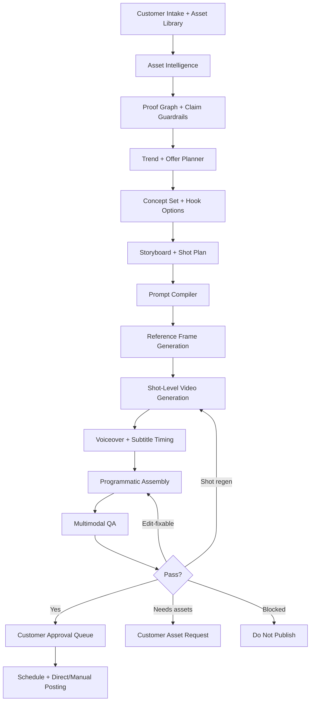

# VIDSLOOM AI Video Generation Pipeline Implementation Plan

Prepared: 2026-06-17

Sources consolidated:

- `VIDSLOOM AI Video Prompting Guide.docx`
- `VIDSLOOM GenAI Video Prompting System.docx`
- Current VIDSLOOM production codebase and deployment notes
- Google AI Gemini API documentation checked on 2026-06-17:
  - Video generation with Veo 3.1: https://ai.google.dev/gemini-api/docs/video
  - Image generation: https://ai.google.dev/gemini-api/docs/image-generation
  - Text-to-speech: https://ai.google.dev/gemini-api/docs/speech-generation
  - Rate limits: https://ai.google.dev/gemini-api/docs/rate-limits

## Executive Decision

VIDSLOOM should not try to ask a video model to generate complete finished ads end to end. The commercial-grade approach is a hybrid generative-programmatic pipeline:

1. AI plans the offer angle, hooks, captions, storyboard, shot prompts, voiceover, and thumbnail.
2. AI image generation creates precise reference frames, thumbnails, product plates, and stills that need tighter brand or composition control.
3. AI video generation creates short motion clips only where motion is the value: food texture, product handling, founder/staff movement, service work, clinic/process shots, venue reveals, and social-native b-roll.
4. VIDSLOOM assembly code adds everything that must be exact: logos, subtitles, proof screenshots, testimonials, prices, offers, CTAs, disclaimers, safe-zone placement, music mix, transitions, and final exports.
5. Multimodal QA and deterministic safety gates block publication unless proof, claims, brand accuracy, mobile readability, and platform fit pass.

This is the only approach that can make VIDSLOOM feel both AI-native and commercially trustworthy. It protects customers from fake proof, hallucinated text, incorrect logos, unreadable captions, and generic stock-looking videos.

## Product Promise

The pipeline must support the VIDSLOOM promise:

- Business owners do not need to produce videos themselves.
- Customers provide business details, proof, offer, brand assets, approval preferences, and optional raw material.
- VIDSLOOM turns those inputs into trend-aware videos, captions, thumbnails, CTAs, posting schedules, approval queues, follow-up assets, and optional direct publishing.
- The system uses real customer proof wherever proof is claimed.
- Public customer-facing pages and app copy remain vendor-neutral. They may say "AI", but must not expose specific model, cloud, backend, or infrastructure names.

## Current Baseline

VIDSLOOM already has the foundation needed for this upgrade:

- Next.js app with public site, app workbench, token-protected customer portal, onboarding, asset upload, and review flow.
- Gemini integration through `@google/genai` for planning and trend intelligence.
- Search-grounded trend intelligence isolated to the trend scout layer.
- Structured campaign generation with deterministic fallback.
- Proof graph, per-concept claim review, storyboard, generation routing, and production QA gate.
- Server-side approval and publishing blocks when quality gates fail.
- GCS-backed generated media storage.
- FFmpeg/Sharp renderer that produces 9:16 MP4 previews and poster frames.
- Cloud Tasks queues for planning, rendering, and publishing.
- YouTube direct publishing path where customer OAuth and app approvals allow it.
- Manual-assisted posting kits for platforms that are not yet fully approved for direct posting.
- Newsletter, lifecycle follow-up, billing, ops alerts, staging, and production deployments.

The current renderer is a proof-of-system preview renderer. The next upgrade is to add actual shot-level AI media generation and deterministic final assembly.

## Target Architecture



### Layer 1: Intake And Asset Intelligence

Purpose: convert customer inputs into a reliable production brief.

Inputs:

- Business name, industry, offer, audience, target geography, brand voice.
- Platforms, duration, video format, approval policy, posting mode, notification settings.
- Proof points, testimonials, reviews, before/after evidence, screenshots, case studies.
- Customer assets: logo, product photos, service photos, founder/staff photos, raw clips, menus, website screenshots, offer sheets, brand guides, compliance notes.

Outputs:

- `CustomerAssetRegistry`: normalized asset records with type, quality score, usage rights, proof role, and recommended use.
- `ProductionBrief`: normalized commercial brief with proof, prohibited claims, compliance notes, brand rules, and platform rules.
- `MissingAssetRequest`: specific customer asks when proof or brand material is insufficient.

Implementation additions:

- Add multimodal asset analysis to replace heuristic-only scoring.
- Extract asset metadata: dimensions, file type, duration for videos, dominant colors, faces/persons present, logo confidence, text presence, proof type, rights status.
- Add signed browser-to-storage uploads for larger raw clips.

### Layer 2: Proof Graph And Claim Guardrails

Purpose: ensure VIDSLOOM never fabricates trust.

Current status: first version exists in `lib/campaign-guardrails.ts`.

Upgrade:

- Link each claim, subtitle line, CTA, proof overlay, and storyboard shot to a specific approved proof item or customer-provided input.
- Store unsupported or risky claims as blocked before generation.
- Require proof ownership and permission metadata before using review screenshots, names, photos, and metrics.
- Keep regulated-industry rules for clinics, medical services, finance, education outcomes, income claims, and before/after claims.

Hard rule: proof is never generated inside the video model. Reviews, testimonials, star ratings, screenshots, awards, before/after evidence, and numerical results must be customer-provided or omitted.

### Layer 3: Trend And Offer Planner

Purpose: choose a viral-aware concept without copying creators or inventing results.

Current status: trend scouting exists.

Upgrade:

- Store trend sources, freshness, platform, category fit, creative formula, risk, and customer applicability.
- Convert trends into reusable formulas:
  - hook type
  - pacing pattern
  - shot rhythm
  - sound/voiceover style
  - proof placement
  - CTA pattern
- Avoid exposing trend scraping details or model/provider names in customer-facing UI.

Acceptance criteria:

- Every trend recommendation must state why it fits the business and which customer proof or asset makes it usable.
- If no credible trend fit exists, the planner must choose a proven evergreen short-form format instead.

### Layer 4: Concept, Hook, And Storyboard Engine

Purpose: produce complete creative plans before spending on video generation.

The reports recommend generating 3-5 concept angles, hook options, and a shot-by-shot storyboard. VIDSLOOM already produces concepts and storyboard fields; the next version should make them production-grade.

Storyboard requirements per shot:

- shot id
- timing start/end
- shot goal
- hook/proof/offer/CTA role
- source type: real asset, generated support, hybrid, programmatic card, screenshot overlay
- required proof item
- reference assets
- subject
- action
- setting
- camera framing
- camera movement
- lighting
- pace
- transition in/out
- overlay text to add in post
- safe-zone requirements
- compliance notes
- generation route
- cost tier
- fallback route

Duration mapping:

| Final Duration | Shot Count | Typical Clip Lengths | Best Use |
| --- | ---: | --- | --- |
| 10s | 2-3 | 2-4s | Flash offer, promo, restaurant special |
| 15s | 3-4 | 3-5s | Default TikTok/Reels/Shorts/X ad |
| 20s | 4-5 | 3-5s | Ecommerce, local service, clinic explainer-lite |
| 30s | 5-6 | 4-6s | Strongest all-round SMB format |
| 45s | 6-8 | 4-8s | B2B, education, objection handling |
| 60s | 8-10 | 4-8s | LinkedIn thought leadership, detailed demos |

Implementation additions:

- Extend current `StoryboardShotSchema`.
- Add a shot segmentation helper based on selected duration.
- Add app controls that let customers choose 10, 15, 20, 30, 45, or 60 seconds and see the recommended use.
- Add "Recommended by VIDSLOOM" duration default by platform/objective.

### Layer 5: Prompt Compiler

Purpose: turn a storyboard shot into model-ready, vendor-neutral internal prompt packets.

The prompt compiler should produce structured output, not free-form strings scattered across the codebase.

Core schemas:

- `MasterVideoBriefPromptInput`
- `StoryboardPromptInput`
- `ShotPromptInput`
- `ReferenceImagePromptInput`
- `VoiceoverPromptInput`
- `SubtitlePromptInput`
- `ThumbnailPromptInput`
- `QAPromptInput`
- `RegenerationPromptInput`
- `CompiledPromptPacket`

Compiled prompt packet:

```ts
type CompiledPromptPacket = {
  id: string;
  campaignId: string;
  conceptId: string;
  shotId: string;
  promptVersion: string;
  invariantBlock: {
    businessName: string;
    industry: string;
    offer: string;
    audience: string;
    brandVoice: string;
    approvedProof: string[];
    prohibitedClaims: string[];
    complianceNotes: string[];
    referenceAssetIds: string[];
    platform: string;
    aspectRatio: "9:16" | "16:9" | "1:1";
    overlayPolicy: "post-production-only";
  };
  shotBlock: {
    shotPurpose: string;
    subject: string;
    action: string;
    scene: string;
    productServiceSpecifics: string;
    camera: string;
    lighting: string;
    pace: string;
    emotion: string;
    mustShow: string[];
    avoid: string[];
    durationSeconds: number;
    continuity: string;
  };
  positivePrompt: string;
  providerNativeNegative?: string;
  qaConstraints: string[];
  safetyConstraints: string[];
  costTier: "preview" | "standard" | "premium";
};
```

Prompt compiler rules:

- Keep the invariant block identical across related shots unless the concept changes.
- Keep each shot to one camera setup, one main subject, one primary action, and one lighting recipe.
- Put "critical text/logos added in post" into every video prompt.
- Convert negative prompts into positive constraints where the provider performs better with positive wording.
- Store prompt version, prompt hash, model route, request metadata, cost estimate, and output references for every generation.
- Never show raw model/provider routing in public customer UI.

### Layer 6: Reference Frame Generation

Purpose: create strong first frames, thumbnails, product plates, and exact-composition anchors.

Google's current Gemini image generation documentation supports image output through `generateContent` with image response modalities and configurable output options. VIDSLOOM should use this layer before video generation wherever composition and brand identity matter.

Use image generation for:

- thumbnail frames
- poster frames
- product hero plates
- clean background plates
- first/last frames for video clips
- title-card backgrounds
- UI mock backgrounds
- still-motion alternatives when video generation is not cost-effective

Rules:

- Logos and exact brand text still stay in post-production overlays unless an approved image-edit workflow proves accurate enough.
- Product identity must be anchored to customer product photos when available.
- Review screenshots, menus, pricing, and proof screenshots should be animated as overlays or still cards, not recreated by AI.

Implementation additions:

- `lib/media-generation/image-provider.ts`
- `lib/media-generation/reference-frames.ts`
- GCS storage namespace: `generated/{env}/{customerId}/{campaignId}/reference-frames/...`
- Portal UI: show reference frames before expensive video generation and allow approve/regenerate.

### Layer 7: Shot-Level Video Generation

Purpose: generate short, high-quality motion clips from shot prompts and reference frames.

Google's current Gemini API video documentation describes long-running video generation operations, 9:16 portrait support, image-to-video, first/last-frame control, video extension, 4/6/8-second clip lengths, and up to three reference images for guided generation. VIDSLOOM should map final ads into multiple short clips, then assemble them.

Use video generation for:

- high-impact first 1-3 seconds
- product handling and use
- food texture and steam
- service work in action
- founder/staff presence when identity can be safely anchored
- environment reveals
- premium paid-campaign hero clips

Avoid video generation for:

- review/testimonial cards
- pricing cards
- dense explanations
- exact website/dashboard demos where screen recording is better
- logos/text/proof
- shots where product identity repeatedly drifts

Implementation additions:

- `lib/media-generation/video-provider.ts`
- `lib/media-generation/video-operations.ts`
- `lib/media-generation/media-jobs.ts`
- Cloud Tasks queue: `vidsloom-media-production` and `vidsloom-media-staging`
- API worker: `POST /api/media/jobs`
- Status endpoint: `GET /api/customer/campaign/:campaignId/media`

Shot generation states:

- `planned`
- `reference-frame-queued`
- `reference-frame-ready`
- `video-queued`
- `video-generating`
- `video-ready`
- `qa-running`
- `qa-passed`
- `edit-fixable`
- `regen-required`
- `needs-customer-assets`
- `blocked`
- `final-assembled`

Cost ladder:

1. storyboard only
2. still reference frame
3. still-motion preview
4. fast/low-cost video clip
5. premium video clip for approved hero/final shots
6. final assembly and QA

### Layer 8: Voiceover, Subtitles, And Audio

Purpose: make videos feel native, clear, and useful even without sound.

The Gemini API currently includes controllable text-to-speech in preview. VIDSLOOM should keep TTS behind a feature flag and always support non-voice subtitle-led videos.

Implementation:

- Generate script and voiceover options from approved claims only.
- Store line-level timing estimates.
- Generate subtitle chunks with 2 lines max and 3-6 words per line where possible.
- Add optional TTS generation only after script approval.
- Normalize loudness and mix with licensed/reusable audio beds where allowed.
- Keep subtitles inside platform safe zones.

Schemas:

- `VoiceoverScript`
- `SubtitleCue`
- `AudioMixSpec`
- `TtsGenerationJob`

Acceptance criteria:

- No TTS line contains unapproved proof, exaggerated outcomes, or regulated claims.
- Every final video works without sound.
- Captions do not cover platform UI zones or important visuals.

### Layer 9: Programmatic Assembly

Purpose: convert generated clips and proof assets into a trustworthy finished ad.

VIDSLOOM should keep FFmpeg/Sharp for the current renderer and add a composition layer that can graduate to Remotion or a browser/HTML renderer when the layouts become more complex.

Assembly handles:

- vertical 9:16 master
- platform-safe crop variants
- logos
- subtitles
- proof screenshot crops
- review/testimonial overlays
- before/after wipes
- offer cards
- CTA cards
- lower thirds
- thumbnails
- transitions
- music and voiceover mixing
- final MP4 export
- poster frame export

Recommended implementation:

- Phase 1: extend current FFmpeg/Sharp renderer with shot-aware composition and overlays.
- Phase 2: add a Remotion renderer for precise typography, timelines, and reusable templates.
- Phase 3: keep FFmpeg as final mux/export tool and fallback path.

Files:

- `lib/video-renderer.ts` evolves into orchestration.
- Add `lib/video-composition.ts`.
- Add `lib/video-overlays.ts`.
- Add `lib/video-safe-zones.ts`.
- Add `lib/video-audio.ts`.
- Add `lib/video-export.ts`.

Hard rule: exact text, logos, proof, prices, and CTAs are rendered by code, not generated by video models.

### Layer 10: Multimodal QA And Regeneration

Purpose: decide whether a video can be shown to the customer, needs edits, needs regeneration, needs more assets, or must be blocked.

The two reports recommend combining creative, technical, brand, proof, platform, and claim-safety scoring.

QA dimensions:

| Dimension | Pass Question |
| --- | --- |
| First-frame impact | Is the business/category clear in under 1 second? |
| 3-second retention | Is there motion, curiosity, proof, or payoff immediately? |
| Business specificity | Could this belong to this customer/category rather than a generic stock ad? |
| Product/service clarity | Is the offer obvious by midpoint? |
| Proof credibility | Is all proof real, attributable, and visually believable? |
| Visual quality | Does the video feel premium? |
| Temporal consistency | No product drift, identity drift, flicker, or object popping? |
| Mobile readability | Will overlays and captions read clearly on phones? |
| Brand fit | Palette, tone, CTA, and asset use align? |
| Platform fit | Feels native to the destination feed? |
| CTA clarity | Specific next step is obvious? |
| Claim safety | No unapproved or risky claims? |
| Fake-proof risk | Zero generated or fabricated proof? |
| Cost efficiency | Did this shot justify the generation cost? |

Decision thresholds:

- Publish-ready: all major creative dimensions >=4, technical dimensions pass, claim safety pass, fake-proof pass.
- Edit-fixable: one or two creative/technical dimensions score 3 and can be fixed in post.
- Shot regeneration: first-frame impact, clarity, temporal consistency, proof credibility, or brand identity is below 4.
- More assets needed: proof-led or brand-identity shot cannot be made credible from current assets.
- Block publish: fake proof, unsupported regulated claim, wrong logo, misleading service/product implication, or unsafe proof use.

Regeneration rules:

- Regenerate only the failing shot when the concept and edit are sound.
- Regenerate the full video when the hook, concept, or multi-shot continuity fails.
- Switch to still-motion when product identity, readable packaging, screenshots, testimonials, menus, or exact room/property details matter.
- Ask the customer for more assets when proof, logo, packaging, founder/staff, or before/after evidence is missing.

Implementation additions:

- `lib/media-generation/media-qa.ts`
- `lib/media-generation/regeneration-policy.ts`
- `MediaQaReportSchema`
- `RegenerationRequestSchema`
- QA snapshots in GCS and Firestore.
- Portal UI showing plain-English QA result, not internal model details.

## Data Model Additions

Add the following collections or typed records in Firestore, prefixed by environment:

### `mediaJobs`

Tracks queueable work across reference frames, video clips, TTS, QA, and assembly.

Fields:

- `id`
- `customerId`
- `campaignId`
- `conceptId`
- `shotId`
- `jobType`
- `status`
- `attempt`
- `priority`
- `costTier`
- `createdAt`
- `startedAt`
- `completedAt`
- `error`
- `nextAction`

### `shotGenerations`

Tracks each shot from plan to output.

Fields:

- `id`
- `campaignId`
- `conceptId`
- `shot`
- `compiledPromptPacket`
- `referenceFrameAsset`
- `videoClipAsset`
- `qaReport`
- `regenerationHistory`
- `costEstimate`
- `actualCostMetadata`
- `publicStatus`

### `promptTemplates`

Versioned prompt inventory.

Fields:

- `id`
- `name`
- `version`
- `templateType`
- `template`
- `schemaVersion`
- `providerAdaptationRules`
- `createdAt`
- `deprecatedAt`

### `assetAnalysis`

Multimodal asset intelligence results.

Fields:

- `assetId`
- `customerId`
- `assetType`
- `detectedText`
- `logoConfidence`
- `productConfidence`
- `facePersonPresence`
- `proofType`
- `qualityScore`
- `usageRightsStatus`
- `recommendedUses`
- `blockedUses`

### `renderCompositions`

Final deterministic edit specifications.

Fields:

- `id`
- `campaignId`
- `conceptId`
- `timeline`
- `overlaySpec`
- `safeZoneSpec`
- `audioSpec`
- `subtitleSpec`
- `exportVariants`
- `sourceClipIds`
- `sourceProofIds`
- `finalAssetIds`

### `costLedger`

Tracks model, render, storage, and publishing costs.

Fields:

- `id`
- `customerId`
- `campaignId`
- `jobId`
- `costType`
- `estimatedCost`
- `actualCost`
- `currency`
- `providerRoute`
- `createdAt`

## Implementation Phases

### P0: Consolidate Plan Into Code Contracts And Fix Current Production Rough Edges

Target: 1-2 working days.

Deliverables:

- Add formal TypeScript schemas for production brief, shot plan, prompt packets, media jobs, QA reports, regeneration requests, and render compositions.
- Add `lib/media-generation/` folder with placeholder modules and deterministic no-op adapters.
- Add prompt template files under `lib/media-generation/prompts/`.
- Map current storyboard output into the new shot plan schema.
- Add duration segmentation helper for 10/15/20/30/45/60-second outputs.
- Fix production `GET /api/customer/assets` with missing portal parameters so it returns a controlled 400/401 instead of 500.
- Add feature flags:
  - `VIDSLOOM_MEDIA_GENERATION_ENABLED`
  - `VIDSLOOM_REFERENCE_FRAME_GENERATION_ENABLED`
  - `VIDSLOOM_VIDEO_CLIP_GENERATION_ENABLED`
  - `VIDSLOOM_TTS_ENABLED`
  - `VIDSLOOM_PREMIUM_VIDEO_MAX_CLIPS`
  - `VIDSLOOM_MEDIA_BUDGET_PER_CAMPAIGN_CENTS`

Tests:

- Schema unit tests by representative restaurant, clinic, ecommerce, consultant, and local-service briefs.
- Prompt compiler snapshot tests.
- API test for unauthenticated/missing-param customer asset route.
- Typecheck, lint, build.

Definition of done:

- Existing production behavior is unchanged unless feature flags are enabled.
- New records can be generated in dry-run mode without external media generation.
- Portal can display shot plan and generation status.

### P1: Asset Intelligence And Shot-Aware Prompt Compiler

Target: 3-5 working days.

Deliverables:

- Multimodal asset analyzer for uploaded logos, product photos, raw clips, screenshots, and proof files.
- Asset registry enrichment with recommended/blocked use.
- Shot-to-asset matching rules:
  - proof overlays use proof assets only
  - product shots prefer real product references
  - service shots prefer real environment/process photos
  - review/testimonial proof uses screenshot overlays only
  - logo uses post-production overlay only
- Full prompt compiler:
  - master brief
  - storyboard
  - per-shot video
  - reference image
  - voiceover
  - subtitles
  - thumbnail
  - QA
  - regeneration
- Provider adaptation layer that keeps internal prompt intent stable while formatting requests for the configured API.

Tests:

- Golden prompt snapshots.
- Asset selection tests where fake proof is blocked.
- Clinic/medical regulated claim tests.
- Portal mobile UI for shot plans and asset requests.

Definition of done:

- VIDSLOOM can produce a complete generation-ready shot pack with no raw provider calls.
- Every shot references approved assets, approved proof, and explicit overlay rules.

### P2: Reference Frames, Thumbnails, And Still-Motion Preview

Target: 5-7 working days.

Deliverables:

- Implement image generation adapter behind `@google/genai`.
- Generate customer-specific reference frames and thumbnails.
- Store generated stills in GCS with provenance.
- Add approval/regeneration flow for reference frames.
- Extend current FFmpeg/Sharp renderer to build still-motion previews from shot plans and generated/reference assets.
- Add low-cost preview mode before video clip generation.

Tests:

- Staging generation with real restaurant, clinic, ecommerce, and local-service briefs.
- Mobile visual QA for thumbnails and preview videos.
- GCS provenance and protected access checks.
- Cost ledger records for each generated image/still preview.

Definition of done:

- Customers can see real customer-specific storyboards, reference frames, thumbnails, and still-motion previews.
- Video generation is still optional and gated behind approval/cost rules.

### P3: Shot-Level AI Video Clip Generation

Target: 1-2 weeks.

Deliverables:

- Implement long-running video generation operations using the configured Gemini API media route.
- Support text-to-video, image-to-video, first-frame generation, first/last-frame generation, and reference-image guidance where available.
- Queue and poll video operations through Cloud Tasks.
- Store raw clips in GCS with prompt version, reference frame, asset references, and QA status.
- Generate 4/6/8-second clips and assemble longer videos from multiple shots.
- Enforce per-campaign budget and max-premium-clip controls.
- Add retry/regeneration policy.

Tests:

- Staging campaign with at least:
  - restaurant 15s
  - ecommerce 20s
  - clinic 30s
  - local service 15s
- Failure-mode tests for timeout, quota/rate limit, blocked safety response, and partial clip failure.
- Proof safety tests: generated clip cannot introduce fake review/ratings/results.
- Build, typecheck, lint.

Definition of done:

- VIDSLOOM can generate actual shot-level AI video clips and assemble them into reviewable customer assets.
- Publishing remains blocked unless QA passes.

### P4: Programmatic Final Assembly, Voiceover, And Platform Variants

Target: 1-2 weeks.

Deliverables:

- Shot-aware final assembly timeline.
- Overlay engine for safe-zone-aware text, proof, CTA, logos, subtitles, and disclaimers.
- Optional Gemini TTS route behind feature flag.
- Audio mixing and loudness normalization.
- Platform variants:
  - TikTok
  - Instagram Reels
  - YouTube Shorts
  - Facebook Reels
  - LinkedIn
  - X
- Export master MP4, platform MP4 variants, poster frame, thumbnail, captions, posting kit, and metadata.

Tests:

- Mobile readability screenshot/video checks.
- Safe-zone overlay tests.
- Subtitle timing tests.
- YouTube Shorts upload test using approved customer account.
- Manual posting kit checks for platforms without direct API approval.

Definition of done:

- The final video feels like a real short-form ad, not a slideshow or hackathon demo.
- Exact proof, logos, subtitles, and CTA render programmatically and reliably.

### P5: Performance Learning And Viral Optimization Loop

Target: ongoing after P3/P4.

Deliverables:

- Published-post proof capture.
- Manual and API-based metrics ingestion.
- Hook and concept performance history.
- Prompt/template performance tracking.
- Automated next-campaign recommendations.
- A/B variants for hooks, thumbnails, captions, CTA, and first 3 seconds.
- Trend formula library updated from real outcomes.

Definition of done:

- VIDSLOOM can learn from what gets views, clicks, bookings, leads, or sales.
- Future videos use customer-specific performance data, not just general trend research.

## Platform And Industry Prompt Adapters

### Platform Adapters

| Platform | Creative Stance | Implementation Rule |
| --- | --- | --- |
| TikTok | native, trend-aware, fast, people-forward | strongest first 1-3 seconds, concise captions, safe zones, avoid fake UI gestures |
| Instagram Reels | polished-native hybrid | better lighting/grade, aspirational but still social-native, avoid UI overlap |
| YouTube Shorts | social-first and skippable | clear value fast, voiceover works, under 60s |
| Facebook Reels | broader demographic, slightly more explanatory | vertical-first, readable text, slightly slower after hook allowed |
| LinkedIn | professional, useful, credible | demo/proof/expertise, subtitles, cleaner framing |
| X | bold, immediate, brand-forward | strong early motion, shorter is better, captions retained |

### Industry Adapters

| Industry | What Viewers Must Trust | Hard Rule |
| --- | --- | --- |
| Restaurants | taste, appetite, immediacy, offer | use real food/menu/location first; never generate fake review text |
| Clinics | safety, credibility, professionalism | no invented outcomes, diagnoses, or treatment claims |
| Ecommerce | product desirability and use-case fit | use real product photos as anchors |
| Coaches | credibility and relatability | never fabricate income/results screenshots |
| Consultants | expertise and decision clarity | precise copy, subtitles, LinkedIn/X-friendly framing |
| Local services | trust and before/after proof | before/after must be real job evidence |
| Agencies | proof and strategy confidence | no invented ROAS, lead counts, or client logos |
| B2B/SaaS | workflow fit and business value | screens/demos beat vague lifestyle footage |
| Beauty/wellness | aspiration plus trust | no unsubstantiated treatment outcomes |
| Education/enrichment | outcome path and warmth | avoid guaranteed score/outcome claims |
| Real estate | accurate space and local context | use real listing media and facts |
| Events | energy and social proof | use real event footage for attendance/proof claims |
| Professional services | credibility and approachability | avoid vague hype and exaggerated guarantees |

## Prompt Inventory To Implement

The two reports converge on the following internal prompt templates:

1. Master video brief prompt.
2. Storyboard prompt.
3. Per-shot video prompt.
4. Reference-image prompt.
5. Product-scene prompt.
6. Service-scene prompt.
7. Background/b-roll prompt.
8. Voiceover prompt.
9. Subtitle prompt.
10. Thumbnail prompt.
11. QA prompt.
12. Regeneration prompt.

Prompt files:

- `lib/media-generation/prompts/master-video-brief.ts`
- `lib/media-generation/prompts/storyboard.ts`
- `lib/media-generation/prompts/per-shot-video.ts`
- `lib/media-generation/prompts/reference-image.ts`
- `lib/media-generation/prompts/product-scene.ts`
- `lib/media-generation/prompts/service-scene.ts`
- `lib/media-generation/prompts/broll.ts`
- `lib/media-generation/prompts/voiceover.ts`
- `lib/media-generation/prompts/subtitles.ts`
- `lib/media-generation/prompts/thumbnail.ts`
- `lib/media-generation/prompts/qa.ts`
- `lib/media-generation/prompts/regeneration.ts`

Each prompt file should export:

- template id
- version
- input schema
- output schema
- public-safe summary
- provider adaptation hints
- examples
- snapshot tests

## Negative And Constraint Libraries

Maintain internal libraries, but do not blindly append them to every provider prompt. Some providers perform better when constraints are rewritten positively.

Universal constraints:

- avoid low-resolution look, flicker, identity drift, warped anatomy, unstable hands, plastic skin, floating objects, inconsistent product shape, unreadable text, distorted logos, off-brand colors, cheap stock-ad feel, random background activity, and duplicate objects.

Fake-proof constraints:

- no fabricated reviews, star ratings, certificates, awards, media logos, analytics dashboards, before/after evidence, customers, patient results, revenue, booking counts, or testimonials.

Brand constraints:

- no misspelled brand names, distorted logos, altered label layouts, changed packaging colors, hallucinated slogans, third-party branding, or signage errors.

Industry constraints:

- medical/clinic: no miracle outcomes, diagnosis claims, unsafe procedures, or fake patient stories.
- restaurant: no plastic food, impossible textures, mismatched plating, or fake steam behavior.
- ecommerce: no SKU drift, wrong packaging, impossible use case, or extra accessories.
- local services: no fake before/after, impossible repair, or misleading property context.

## Customer UX Changes

The customer portal should make the pipeline feel simple, not technical.

Customer-visible steps:

1. VIDSLOOM studies your offer, audience, proof, and brand.
2. VIDSLOOM selects trend-aware video angles.
3. VIDSLOOM creates storyboards and shows what proof each video uses.
4. VIDSLOOM generates preview frames and videos.
5. You approve, request edits, or ask VIDSLOOM to use more assets.
6. VIDSLOOM schedules and posts when your connected accounts allow it, or gives you a ready posting kit.
7. VIDSLOOM follows up with performance and next-video recommendations.

Hide from public UI:

- model names
- provider names
- cloud infrastructure
- queue names
- prompt internals
- raw cost routing

Show to customers:

- proof used
- readiness status
- video length
- platform
- approval status
- publishing permissions needed
- plain-English reason if a video is blocked
- next action

## Engineering Sequence

Recommended order:

1. Fix the customer asset route 500.
2. Add schemas and prompt inventory.
3. Add media job records and dry-run adapters.
4. Add duration segmentation and shot-plan UI.
5. Add asset intelligence and shot-to-asset matching.
6. Add prompt compiler snapshots.
7. Add reference frame generation behind a feature flag.
8. Add still-motion preview from shot plans.
9. Add video clip generation behind a staging-only flag.
10. Add QA and regeneration worker.
11. Add final assembly overlays.
12. Enable production beta for one internal/customer test account.
13. Expand to paid customers with cost caps and plan-based limits.

## GCP And Deployment Plan

Project:

- `business-heroes-infinity`

Existing:

- Cloud Run staging and production.
- Firestore environment-prefix separation.
- GCS generated asset bucket.
- Cloud Tasks planning/rendering/publishing queues.
- Cloud Scheduler sweeps and ops alerts.

Add:

- Cloud Tasks queue for media generation:
  - `vidsloom-media-staging`
  - `vidsloom-media-production`
- API worker:
  - `/api/media/jobs`
- Secret Manager entries as needed:
  - media generation feature flags
  - media budget controls
  - optional TTS flag
- Monitoring:
  - media job backlog
  - failed media jobs
  - video generation timeout rate
  - budget exhaustion
  - provider/rate-limit errors
  - QA block rate

Deployment gates:

- Staging only until at least four full campaign types pass.
- Production beta only for selected test customers.
- Default production mode remains current renderer until video generation is stable.
- Direct publishing remains blocked unless customer OAuth and platform permissions are valid.

## Cost Controls

The reports are clear: spend should happen after cheap validation.

Controls:

- Use planning and still frames before video clips.
- Generate only the winning concept by default.
- Limit premium video generation to the first hook shot and key product/service shots.
- Use still-motion for review cards, proof overlays, screenshots, offer cards, and menus.
- Cache prompt skeletons, industry adapters, and approved reference frames.
- Store per-campaign budget caps.
- Expose customer-facing package limits without exposing provider costs.

Plan packaging:

- Starter: still-motion previews plus limited video clips.
- Growth: more clips, more variants, scheduling, and monthly campaigns.
- Managed: premium clips, human-assisted QA, custom case studies, and campaign strategy.

## Security, Privacy, And Compliance

Requirements:

- Customer assets served only through authorized routes.
- Proof screenshots, names, faces, results, and client logos require usage rights.
- Do not use customer assets for unrelated customers.
- Store generation provenance for every asset.
- No raw secrets, tokens, provider traces, or internal routes in public responses.
- Public site and portal copy stays vendor-neutral.
- Regulated claims blocked unless substantiated.
- Direct posting requires customer OAuth and platform-approved scopes.

## Acceptance Criteria For A World-Class VIDSLOOM Video

A generated video is publish-ready only if:

- It is clearly about the customer or customer category within the first second.
- The first 1-3 seconds contain motion, relevance, and either proof or payoff.
- The offer is understandable by the midpoint.
- It looks premium and platform-native on a phone.
- The product, service, or location is accurate.
- All proof is real and traceable to customer-provided assets or claims.
- All text, logos, prices, subtitles, and CTAs are readable and safe-zone-aware.
- No public-facing surface reveals model or infrastructure names.
- The claim review passes.
- The multimodal QA report passes.
- The customer approval state allows publishing.
- The customer social account permission state allows direct posting, or a manual posting kit is provided.

## Immediate Next Actions

1. Create P0 schemas and dry-run media generation modules.
2. Fix the unauthenticated/missing-parameter `/api/customer/assets` 500.
3. Add duration segmentation and recommended duration UI language.
4. Add prompt template inventory and snapshot tests.
5. Add media job queue contract without enabling external video generation.
6. Add reference-frame generation in staging.
7. Run one staging customer campaign end to end:
   - restaurant, 15s
   - ecommerce, 20s
   - clinic, 30s
   - local service, 15s
8. Only after those pass, enable one production beta customer.

## Final Recommendation

Proceed in this order:

- P0 immediately: contracts, prompt inventory, dry-run job layer, route fix.
- P1 next: asset intelligence and prompt compiler.
- P2 next: reference frames and still-motion preview.
- P3 next: actual AI video clips.
- P4 next: final assembly, subtitles, voiceover, and variants.
- P5 ongoing: performance learning and viral optimization.

This makes VIDSLOOM commercially credible quickly while avoiding the main failure mode of AI video products: impressive-looking clips that cannot be trusted, cannot be safely posted, or do not actually sell the customer’s offer.
